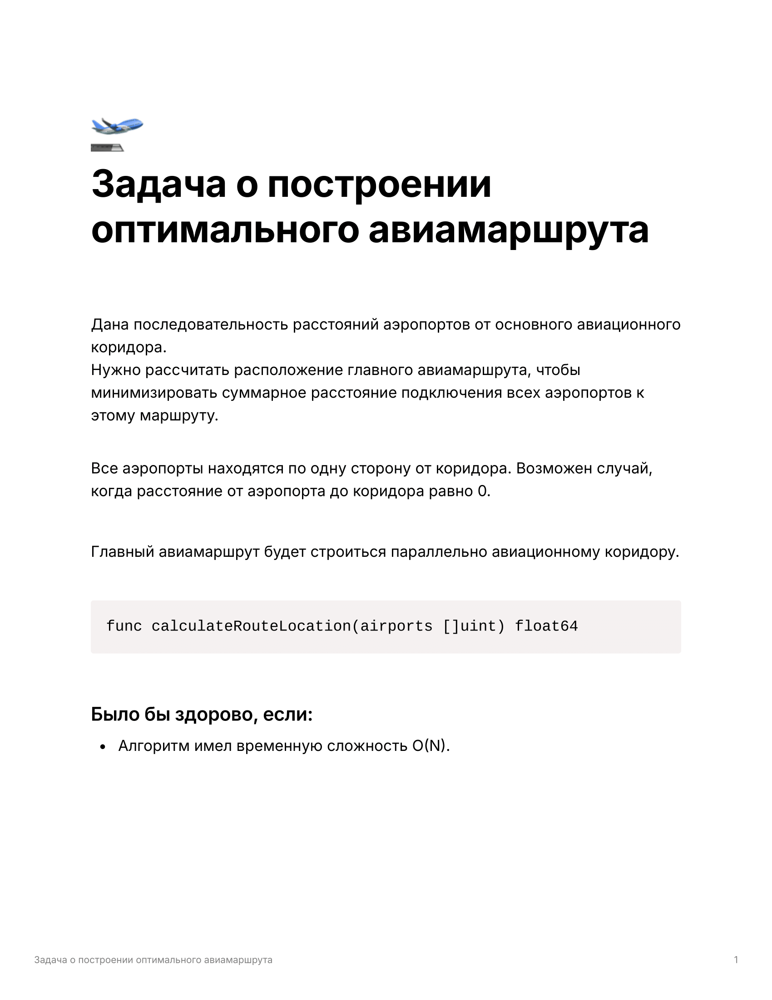

<h1>Utair Тестовое задание</h1>


---

<h2> 1. Постановка задачи </h2>



<h2> 2. Структура проекта </h2>

<pre>
├── src
│   ├── init.py
│   └── main.py
├── tests
│   ├── init.py
│   └── test_calculate.py
├── .gitignore
├── .pre-commit-config.yaml
├── poetry.lock
├── pyproject.toml
├── README.md
└── task.png
</pre>

<h2> 3. Решение проблемы </h2>

<p>
В Python есть встроенная библиотека <b>statistics</b>, которая предоставляет функции для работы с статистическими данными, включая функцию median. Она вычисляет медиану и автоматически оптимизирует процесс, занимаясь как сортировкой, так и вычислением.
</p>

<h2> 4. Установка и запуск </h2>

*Установить python и poetry в свою систему*

```
poetry install
poetry run python src/main.py
```

<h2> 4. Запуск тестов </h2>

```
poetry run pytest
```